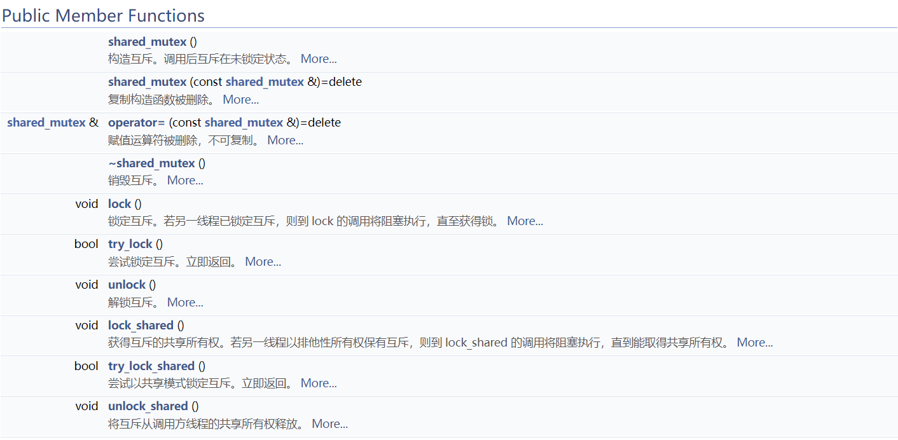

# 手打shared_mutex（一）

## shared_mutex接口简介

shared_mutex 类是一个同步原语，可用于保护共享数据不被多个线程同时访问。

与便于独占访问的其他互斥类型不同，shared_mutex 拥有二个访问级别：

- 共享 - 多个线程能共享同一互斥的所有权。

- 独占性 - 仅一个线程能占有互斥。

shared_mutex类的公开方法包括：

std::shared_mutex是在C++17标准中引入的，std::shared_mutex的更完整描述可以在[cppreference.com](https://en.cppreference.com/w/cpp/thread/shared_mutex)网页上找到。

## shared_mutex实现原理

对于非C++标准来说，shared_mutex的更容易理解的名称是**读写锁**（read-write lock）。

相比于**读写锁**，更基础的是**互斥锁**，所以我们就从互斥锁说起（互斥锁在C++标准中的实现是std::mutex）。

**互斥锁**会把试图进入**临界区**的所有其他线程都阻塞住。该临界区通常涉及对由这些线程共享的一个或多个数据的访问或更新。然而有时候我们可以在**读**某个数据与**修改**某个数据之间作区分。这也是使用**读写锁**的场景条件之一。

对于在获取读写锁用于读或获取读写锁用于写之间作区别，规则如下：
- 只要没有线程持有某个给定的读写锁用于写，那么任意数目的线程可以持有该读写锁用于读。
- 仅当没有线程持有某个给定的读写锁用于读或用于写时，才能分配给读写锁用于写。

换一种说法就是，只要没有线程在修改某个给定的数据，那么任意数目的线程都可以拥有该数据的读访问权。仅当没有其他线程在读或修改某个给定的数据时，当前线程才可以修改它。

某些应用中读数据比修改数据频繁，这些应用可从改用读写锁代替互斥锁中获益。任意给定时刻允许多个读出者存在提供了更高的并发度，同时在某个写入者修改数据期间保护该数据，以免任何其他读出者或写入者的干扰。这也是判断是否应该使用**读写锁**的依据之一。

这种对于某个给定资源的共享访问也称为共享-独占（shared-exclusive）上锁（我想这就是shared_mutex中shared的由来吧），因为获取一个读写锁用于读称为**共享锁**（shared lock），对应的就是shared_mutex::lock_shared方法，获取一个读写锁用于写称为**独占锁**（exclusive lock），对应的就是shared_mutex::lock方法。有人可能有疑问，为啥shared_mutex::lock方法，不叫lock_unique之类的呢？其实原因是为了跟std::mutex的lock方法一致，而这样做的原因是为了让std::lock_guard和std::unique_lock能复用在shared_mutex上，具体细节这里就不展开了。

